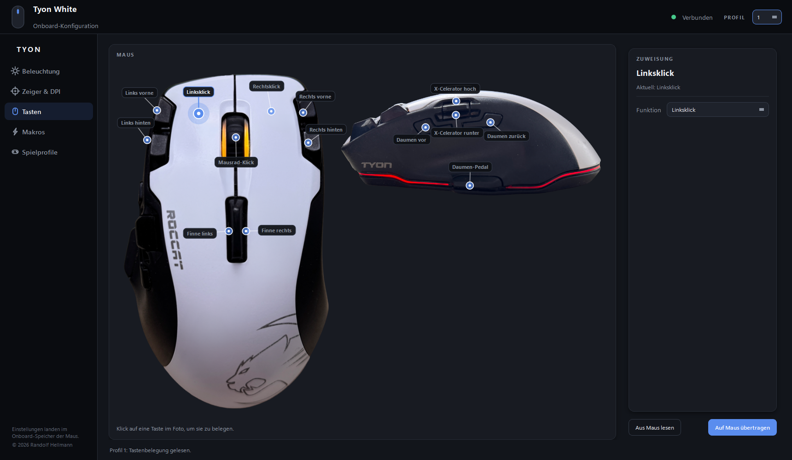

# Roccat Tyon RGB

A modern Windows replacement for the discontinued Roccat Tyon driver.
Configure **RGB lighting, DPI, polling rate, button mappings, onboard macros,
and per-game profiles** — all written straight to the mouse's onboard flash, so
your settings survive unplug, reboot, and even moving the mouse to another PC.

No background service, no telemetry, no account. Just HID feature reports going
straight to the mouse, in readable Python.

_By **Randolf Hellmann** ([@RandolfHellmann](https://github.com/RandolfHellmann)) · MIT licensed._


## Why this exists

The Roccat Tyon was a flagship gaming mouse from 2014-2015. Turtle Beach
acquired Roccat in 2019 and quietly dropped support for legacy products.
The official Tyon driver:

- is no longer hosted on any current Roccat / Turtle Beach support page,
- nags you for an update on first launch and points at a host that no
  longer exists,
- is increasingly cranky under Windows 11.

This tool replaces it in pure Python — readable, forkable, no background
service, no telemetry, no account, just HID feature reports going straight to
the mouse.

## Features

### Lighting
- **Persistent RGB** written to onboard profile flash — survives unplug
- **Custom HSV color wheel** with saturation/value square, RGB inputs, and
  hex input, all bidirectionally synced
- **Software brightness** scaling so you can dim any color without picking a
  different one
- **Standard palette** plus a 5-slot recently-used row that persists across
  launches
- **Per-zone control** of the scroll-wheel light and the bottom light
  independently
- **Effects**: solid, blink, breathe, heartbeat, off — with a speed control

### Pointer & DPI
- **5 DPI stages** per profile (200-8200 CPI); enable/disable each stage,
  set its CPI, and choose which one is active
- **Polling rate**: 125 / 250 / 500 / 1000 Hz
- **Scroll-wheel inversion** toggle (natural scrolling)

### Buttons & macros
- **Visual button map** — real photos of the mouse (top + left side) with a
  clickable pin on every button: click a button on the photo to assign it.
  Falls back to an original drawn schematic if no photos are present in
  `assets/`.
- **Remap the physical buttons** — including the X-Celerator paddle and the
  Dorsal-Fin rocker — to clicks, navigation, DPI shift, media keys, and more
- **Simple key / shortcut assignment**: click a button, press the key combo you
  want (e.g. <kbd>Ctrl</kbd>+<kbd>Shift</kbd>+<kbd>V</kbd>), done
- **Onboard macro recorder**: record a key sequence (or build one by hand), set
  a loop count, and **flash it to a button**. It lives in the mouse's own
  memory, so it replays even on a PC with no software installed



### Game profiles
- Map each game to one of the five onboard mouse profiles
- **Optional, opt-in auto-switch**: a lightweight watcher notices which game is
  in the foreground and activates the matching onboard profile. It only ever
  **reconfigures the mouse** — it never injects input into a running game, so
  it is safe even with kernel-level anti-cheat. Off by default.

### StarCraft II build-order trainer
- **Record an opening** (your clicks and hotkeys) and replay it as a practice
  aid. Uses a camera anchor (Backspace centers on your main) plus
  resolution-aware scaling so a replay lands where you recorded it.
- Replay is **faithful and verbatim** — it plays back exactly what you did,
  including your own shift-queues. There is no "smart" automation.
- Start delay, an abort hotkey, and a prominent in-app disclosure (see below).

## A note on fair play

This tool draws a hard line, on purpose:

- **Comfort and configuration only.** Lighting, DPI, button remaps, key
  assignment, comfort macros, profile switching, and the SC2 build-order
  trainer are all about setting up your hardware and practicing — not about
  reaching into a live match.
- **Warzone and other kernel-anti-cheat titles:** the tool uses *onboard*
  features only (macros stored on the mouse, profile switching). It does **not**
  inject any host-side input into a running game. The auto-switch watcher reads
  the foreground process name and changes the active mouse profile; that's it.
- **The build-order trainer is host-side** and therefore a ToS gray area for
  online play. It's intended as a practice/ladder-warmup aid. The app says so,
  in the app. Use your own judgement.
- **It will never include combat automation** — no anti-recoil, no rapid-fire,
  no auto-strafe, no drop-shot-on-demand. Those give an unfair multiplayer
  advantage and are out of scope, permanently.

## Requirements

- Windows 10/11 (Linux/macOS not supported — the HID interface routing on
  Windows differs from Linux, see [Protocol Notes](#protocol-notes))
- Python 3.10 or newer (3.12 recommended)
- A Roccat Tyon, plugged in via USB
- The build-order trainer additionally uses [`pynput`](https://pypi.org/project/pynput/)
  (installed by `requirements.txt`)

## Install

```pwsh
git clone https://github.com/RandolfHellmann/roccat-tyon-rgb.git
cd roccat-tyon-rgb
py -3 -m venv .venv
.\.venv\Scripts\Activate.ps1
pip install -r requirements.txt
```

## Run

GUI:

```pwsh
.\gui.bat
```

`make_icon.py` generates `tyon.ico`; a Desktop shortcut can be created that
points at `.venv\Scripts\pythonw.exe tyon_gui.py` (working directory = the repo)
so the app launches with the proper icon and no console window.

CLI (lighting + diagnostics):

```pwsh
.\rgb.bat --color FF00FF                       # both zones magenta, active profile
.\rgb.bat --wheel FF0000 --bottom 0000FF       # wheel red, bottom blue
.\rgb.bat --profile 2 --color 00FFFF           # set profile 3 to cyan
.\rgb.bat --color 00FF00 --effect breathe      # green, breathing
.\rgb.bat --read                               # inspect all 5 profiles
.\rgb.bat --off                                # turn lights off on active profile
.\rgb.bat --live --color FFFFFF                # quick TalkFX (no flash write)
.\rgb.bat --probe                              # list HID interfaces
```

`rgb.bat --help` lists every flag.

## Where settings live

GUI preferences, game profiles, and recorded build orders are stored under
`%APPDATA%\RoccatTyonRGB` (so the repo stays clean and your settings survive a
reinstall or a `git pull`). The mouse's lighting, DPI, buttons, and macros live
in the mouse's own onboard flash, not on disk.

## Project layout

| File | Purpose |
|---|---|
| `tyon_rgb.py` | Core device library + standalone CLI |
| `tyon_gui.py` | PySide6 GUI (the app) |
| `tyon_widgets.py` | Theme, color wheel, and custom widgets |
| `tyon_input.py` | Host-side recorder/player (pynput) for the SC2 trainer |
| `tyon_store.py` | Persistent prefs, game profiles, and build orders |
| `make_icon.py` | Generates `tyon.ico` for the Desktop shortcut |
| `rgb.bat` / `gui.bat` | Convenience launchers (use the venv python) |
| `docs/screenshot.png` | The hero image above |

## Protocol notes

Most of the work here was figuring out how to talk to the mouse on
Windows. Two non-obvious findings that are worth flagging for anyone
building similar tools:

### 1. Vendor HID lives under a Telephony collection on Windows

The Linux `roccat-tools` driver hardcodes `endpoint = 0` (= the mouse USB
interface, `MI_00`) for every HID feature report. On Windows, that
interface exposes **three** top-level HID collections, and only one of
them — the **Telephony** collection (`usage_page == 0x000B`) — accepts
the vendor feature reports. Writing to the mouse, consumer-control, or
MISC collections silently fails with `-1`.

My guess is Roccat tucked their vendor commands under a Telephony usage
page to dodge Windows HID filtering of mouse/keyboard reports. Took two
iterations of writing to the wrong path before I spotted it.

```python
def find_vendor_interface(infos):
    for info in infos:
        if info.get("usage_page") == 0x000B:
            return info
    return None
```

### 2. The lighting paths and their trade-offs

There are two independent ways to set the RGB on a Tyon:

| | TalkFX (Live) | Profile (Persistent) |
|---|---|---|
| Report ID | `0x10` | `0x06` |
| Size | 16 bytes | 30 bytes |
| Persists across unplug | ❌ | ✅ |
| Per-zone colors | ❌ (one ambient + one event) | ✅ (wheel + bottom) |
| Effects | yes | yes |
| Checksum | no | yes (16-bit little-endian sum) |
| Needs CONTROL handshake | no | yes (`0x04`, poll until `value == 1`) |

The persistent path is more work but is the "real" way the mouse was
designed to be configured. TalkFX masks the profile color until cleared
or until the next power cycle.

### 3. CONTROL handshake

For every persistent write you also poll `feature_report 0x04`. The
response's second byte is the status: `1 = OK`, `2 = INVALID`,
`3 = BUSY` (wait + retry), `4 = CRITICAL`. Initial wait 200 ms, then
500 ms intervals while busy.

### 4. DPI, buttons, and macros

- **DPI** is stored as `cpi / 50` (so 50 CPI per unit), five stages per
  profile, with an enabled-mask and an active-stage index in
  `ProfileSettings` (report `0x06`, 30 bytes).
- **Buttons** live in `ProfileButtons` (report `0x07`, 99 bytes, no
  checksum). Scroll-wheel inversion is just swapping the `scroll_up` /
  `scroll_down` actions on the wheel button slots.
- **Macros** are written as `ProfileButtons`-linked macro blobs (report
  `0x08`, ~2 KB across two transfers, no checksum). Each keystroke is
  `(HID key, press/release, period_ms)`.

All of these are reverse-engineered in the same `tyon/libroccattyon/`
directory of roccat-tools (see Credits).

## Credits

The protocol layout is entirely thanks to the Linux
[**roccat-tools**](https://github.com/ngg/roccat-tools) project by
**erazor_de**, originally on SourceForge. Their reverse-engineered C code
under `tyon/libroccattyon/` is the authoritative reference for the Tyon
HID protocol; this tool is a Windows port in Python. If you want to extend
it to cover the X-Celerator paddle or sensitivity curves, that source tree
is where the answers live.

## What's not (yet) included

- **X-Celerator analog paddle** calibration
- **Sensitivity / acceleration** curves
- **Easy-Shift[+]** secondary button layer (only the primary layer is
  remapped today)

All are documented in the same `tyon/libroccattyon/` directory of
roccat-tools. PRs welcome.

## License

MIT © 2026 Randolf Hellmann — see [LICENSE](LICENSE). The only requirement
when using this code is to keep the copyright notice in place.
