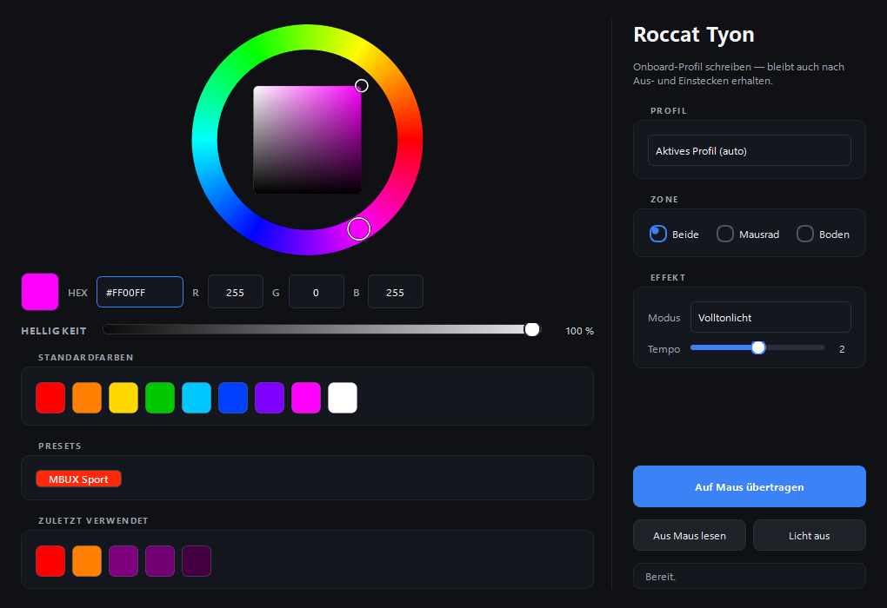

# Roccat Tyon RGB

A Windows replacement for the discontinued Roccat Tyon driver, focused on
RGB lighting. Writes directly to the mouse's onboard profile flash, so your
settings survive unplug, reboot, and even moving the mouse to another PC.



## Why this exists

The Roccat Tyon was a flagship gaming mouse from 2014-2015. Turtle Beach
acquired Roccat in 2019 and quietly dropped support for legacy products.
The official Tyon driver:

- is no longer hosted on any current Roccat / Turtle Beach support page,
- nags you for an update on first launch and points at a host that no
  longer exists,
- is increasingly cranky under Windows 11.

This tool replaces the lighting portion of that driver in pure Python —
readable, forkable, no background service, no telemetry, no account, just
HID feature reports going straight to the mouse.

## Features

- **Persistent RGB** written to onboard profile flash — survives unplug
- **Live RGB** via TalkFX (RAM-only, instant) when you don't want to touch
  the profile
- **Custom HSV color wheel** with saturation/value square, RGB inputs,
  hex input, all bidirectionally synced
- **Software brightness** scaling so you can dim any color without
  picking a different one
- **Standard color palette** and a 5-slot recently-used row that
  persists across launches
- **Per-zone control** of the scroll wheel light and the bottom light
  independently
- **All five onboard profiles** addressable, including read-back so you
  can audit what's currently flashed
- **Lighting effects**: solid, blink, breathe, heartbeat, off — with a
  speed control
- **Both Tyon variants** supported (Black `1E7D:2E4A`, White `1E7D:2E4B`)
- **Standalone CLI** for scripting and quick tests

## Requirements

- Windows 10/11 (Linux/macOS not supported — the HID interface routing on
  Windows differs from Linux, see [Protocol Notes](#protocol-notes))
- Python 3.10 or newer (3.12 recommended)
- A Roccat Tyon, plugged in via USB

## Install

```pwsh
git clone https://github.com/RandolfHellmann/roccat-tyon-rgb.git
cd roccat-tyon-rgb
py -3 -m venv .venv
.\.venv\Scripts\Activate.ps1
pip install -r requirements.txt
```

## Run

GUI:

```pwsh
.\gui.bat
```

CLI:

```pwsh
.\rgb.bat --color FF00FF                       # both zones magenta, active profile
.\rgb.bat --wheel FF0000 --bottom 0000FF       # wheel red, bottom blue
.\rgb.bat --profile 2 --color 00FFFF           # set profile 3 to cyan
.\rgb.bat --color 00FF00 --effect breathe      # green, breathing
.\rgb.bat --read                               # inspect all 5 profiles
.\rgb.bat --off                                # turn lights off on active profile
.\rgb.bat --live --color FFFFFF                # quick TalkFX (no flash write)
.\rgb.bat --probe                              # list HID interfaces
```

`rgb.bat --help` lists every flag.

## Project layout

| File | Purpose |
|---|---|
| `tyon_rgb.py` | Core library + standalone CLI |
| `tyon_gui.py` | PySide6 GUI |
| `rgb.bat` / `gui.bat` | Convenience launchers (use the venv python) |
| `docs/screenshot.png` | The hero image above |

## Protocol notes

Most of the work here was figuring out how to talk to the mouse on
Windows. Two non-obvious findings that are worth flagging for anyone
building similar tools:

### 1. Vendor HID lives under a Telephony collection on Windows

The Linux `roccat-tools` driver hardcodes `endpoint = 0` (= the mouse USB
interface, `MI_00`) for every HID feature report. On Windows, that
interface exposes **three** top-level HID collections, and only one of
them — the **Telephony** collection (`usage_page == 0x000B`) — accepts
the vendor feature reports. Writing to the mouse, consumer-control, or
MISC collections silently fails with `-1`.

My guess is Roccat tucked their vendor commands under a Telephony usage
page to dodge Windows HID filtering of mouse/keyboard reports. Took two
iterations of writing to the wrong path before I spotted it.

```python
def find_vendor_interface(infos):
    for info in infos:
        if info.get("usage_page") == 0x000B:
            return info
    return None
```

### 2. The lighting paths and their trade-offs

There are two independent ways to set the RGB on a Tyon:

| | TalkFX (Live) | Profile (Persistent) |
|---|---|---|
| Report ID | `0x10` | `0x06` |
| Size | 16 bytes | 30 bytes |
| Persists across unplug | ❌ | ✅ |
| Per-zone colors | ❌ (one ambient + one event) | ✅ (wheel + bottom) |
| Effects | yes | yes |
| Checksum | no | yes (16-bit little-endian sum) |
| Needs CONTROL handshake | no | yes (`0x04`, poll until `value == 1`) |

The persistent path is more work but is the "real" way the mouse was
designed to be configured. TalkFX masks the profile color until cleared
or until the next power cycle.

### 3. CONTROL handshake

For every persistent write you also poll `feature_report 0x04`. The
response's second byte is the status: `1 = OK`, `2 = INVALID`,
`3 = BUSY` (wait + retry), `4 = CRITICAL`. Initial wait 200 ms, then
500 ms intervals while busy.

## Credits

The protocol layout is entirely thanks to the Linux
[**roccat-tools**](https://github.com/ngg/roccat-tools) project by
**erazor_de**, originally on SourceForge. Their reverse-engineered C code
under `tyon/libroccattyon/` is the authoritative reference for the Tyon
HID protocol; this tool is essentially a Windows port of the lighting
portion in Python. If you want to extend it to cover DPI, button
remapping, macros, or the X-Celerator paddle, that source tree is where
the answers live.

## What's not (yet) included

This tool covers RGB lighting only. The original Roccat software also
configured:

- DPI levels (5 stages per profile, 200-8200 CPI)
- Polling rate
- Button assignments (32 slots — 16 physical buttons × primary + Easy-Shift)
- Macros
- X-Celerator analog paddle calibration
- Sensitivity and acceleration

All of these are documented in the same `tyon/libroccattyon/` directory
of roccat-tools. PRs welcome.

## License

MIT — see [LICENSE](LICENSE). The only requirement when using this code
is to keep the copyright notice in place.
